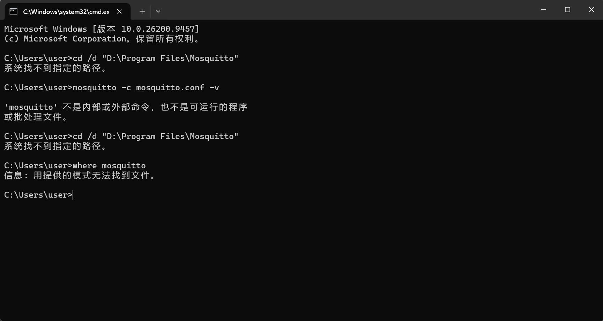
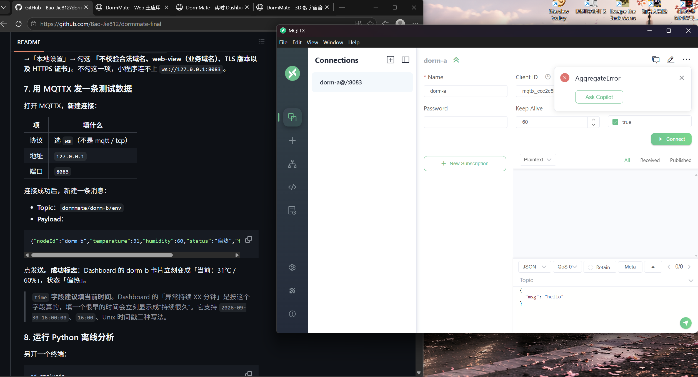

# 复现者问题记录

记录日期：2026-10-02
复现范围：按 README「如何启动」顺序，从零把系统跑起来并复现一条实时数据链。

复现过程总体顺利，卡在两个点，都出在「Broker 起来之前」这一段。

---

## 卡点一：Broker 启动即报错退出，MQTTX 一直连不上

### 现象

按 README 在 `D:\Program Files\Mosquitto` 下执行：

```cmd
mosquitto -c mosquitto.conf -v
```

窗口里立刻打印一行错误，然后进程直接退出（黑窗口关掉或停在提示符，不再有监听日志）：

```
Invalid 'protocol' value
```

Broker 没有起来，自然也就没有任何端口在监听，后续所有端都连不上。



### 原因

`mosquitto.conf` 里把两条配置写在了同一行：

```conf
protocol websockets allow_anonymous true
```

mosquitto 的配置文件是**按行解析**的，一行只认一个配置项。这样写等于让 `protocol` 去解析 `websockets allow_anonymous true` 这一整串，解析失败就直接报 `Invalid 'protocol' value` 并退出。

### 解决

改成每条配置独立成行，配置项之间留空行：

```conf
allow_anonymous true

listener 8083
protocol websockets
```

改完重新执行 `mosquitto -c mosquitto.conf -v`，窗口出现成功标志：

```
Opening websockets listen socket on port 8083.
```


---

## 卡点二：MQTTX 连接反复报 ECONNREFUSED

### 现象

在 MQTTX 里新建连接后点「连接」，反复失败，错误信息为：

```
connect ECONNREFUSED 127.0.0.1:8083
```



### 原因

`ECONNREFUSED` 的含义是「这个地址和端口上没有任何东西在监听」，对应两种情况：

1. **Broker 没有成功启动**（就是卡点一——进程启动后立刻退出了，8083 上根本没有监听）；
2. **MQTTX 里 Host / Port 填错**，例如协议选成了 `mqtt`（TCP），而本机 Broker 只开了 WebSocket。

### 解决

1. 先修好卡点一，确认 Mosquitto 窗口停留在 `Opening websockets listen socket on port 8083.` 这一行、窗口保持打开；
2. 再逐项核对 MQTTX 连接表单：

| 项 | 值 |
| --- | --- |
| 协议 | `ws` |
| Host / 地址 | `127.0.0.1` |
| Port / 端口 | `8083` |
| Username | 留空 |
| Password | 留空 |
| SSL / TLS | 关闭 |

两项都确认后重新连接，连接成功（见 [03_二次复现结果.md](03_二次复现结果.md)）。
