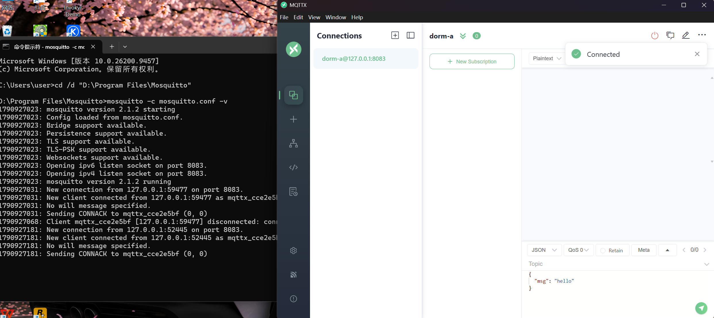
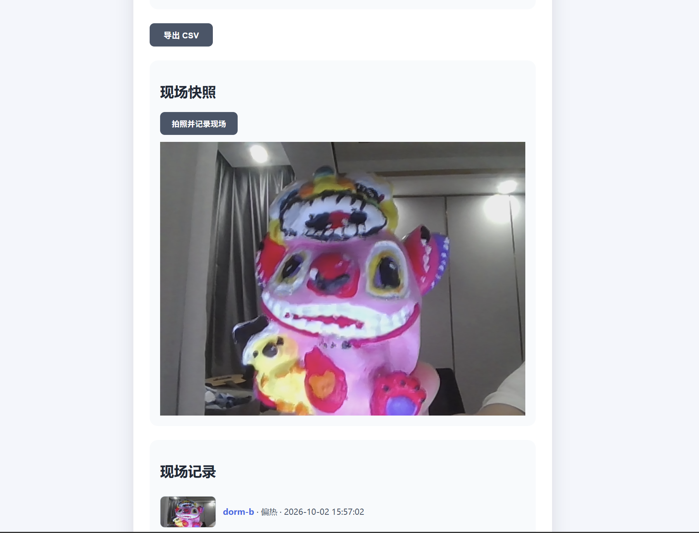

# 二次复现结果

在按 [02_README修订说明.md](02_README修订说明.md) 修订 README 之后，复现者重新完整走了一遍「如何启动」，结果如下。

---

## 复现结果一览

| 步骤 | 结果 | 截图 |
| --- | --- | --- |
| 启动 Mosquitto Broker | ✅ 成功 | [Broker 启动成功](02_解决后截图/Broker启动成功.png) |
| MQTTX 连接 Broker | ✅ 成功 | [MQTTX 连接成功](03_复现成功截图/MQTTX连接成功.png) |
| Web 主应用收到数据 | ✅ 同步更新 | [Web 收到数据](03_复现成功截图/Web收到数据.png) |
| Dashboard 收到数据 | ✅ 同步更新 | [Dashboard 收到数据](03_复现成功截图/Dashboard收到数据.png) |
| 3D 数字空间收到数据 | ✅ 同步更新 | [3D 收到数据](03_复现成功截图/3D收到数据.png) |
| Web 主页拍照功能 | ✅ 正常使用 | [Web 主页拍照功能](03_复现成功截图/Web主页拍照功能.png) |

---

## 1. Broker 成功启动

按修订后的 README 把 `mosquitto.conf` 改成每条配置独立成行，重新执行：

```cmd
cd /d "D:\Program Files\Mosquitto"
mosquitto -c mosquitto.conf -v
```

窗口输出成功标志，且进程保持运行：

```
Opening websockets listen socket on port 8083.
```


## 2. MQTTX 成功连接

按修订后的字段表逐项填写（协议 `ws`、Host `127.0.0.1`、Port `8083`、Username / Password 留空、SSL / TLS 关闭），连接成功，不再出现 `ECONNREFUSED`。



## 3. 发送测试数据，三端同时收到

在 MQTTX 向以下 Topic 发送一条 dorm-b 偏热数据：

- Topic：`dormmate/dorm-b/env`
- Payload：

```json
{"nodeId":"dorm-b","temperature":31,"humidity":60,"status":"偏热","time":"2026-09-30 16:00:00"}
```

三个端**同时**收到并刷新，字段完全一致（`nodeId=dorm-b`、`temperature=31`、`humidity=60`、`status=偏热`）：

| 端 | 观察到的结果 | 截图 |
| --- | --- | --- |
| Web 主应用 | 选中 dorm-b 时，当前结果变为「偏热」，温度为 31℃、湿度 60% | [Web 收到数据](03_复现成功截图/Web收到数据.png) |
| Dashboard | dorm-b 卡片显示「当前：31℃ / 60%」、状态「偏热」，趋势图新增数据点 | [Dashboard 收到数据](03_复现成功截图/Dashboard收到数据.png) |
| 3D 数字空间 | dorm-b 房间按偏热状态变化，同步显示当前节点与状态 | [3D 收到数据](03_复现成功截图/3D收到数据.png) |

**实时数据链验证通过**：一条 MQTT 报文从 Broker 出发，同一时刻点亮三个端，且四端字段一致，说明各端的订阅 Topic 与解析逻辑都正确。

## 4. Web 主页拍照功能

除数据链外，另行验证了 Web 主应用的「拍照并记录现场」功能：点击按钮后调用本机摄像头，成功拍下现场快照并显示在「现场快照」区。



---

## 结论

**交叉复现成功，核心数据链完整跑通。**

- 两个卡点均已定位并解决：`mosquitto.conf` 每条配置独立成行后 Broker 正常启动；MQTTX 按字段表连接后不再报 `ECONNREFUSED`。
- 修订后的 README 可以让复现者不再依赖额外解释，直接照做即可启动全链路。
- 一条 `dormmate/dorm-b/env` 报文可同时驱动 Web、Dashboard、3D 三端更新，字段一致；Web 端拍照功能可用。

### 截图目录

```
Evidence/Reproduce/
├── 01_问题截图/          Broker 启动失败、MQTTX 连接失败
├── 02_解决后截图/        Broker 启动成功
└── 03_复现成功截图/      MQTTX 连接成功、Web / Dashboard / 3D 收到数据、Web 拍照功能
```
