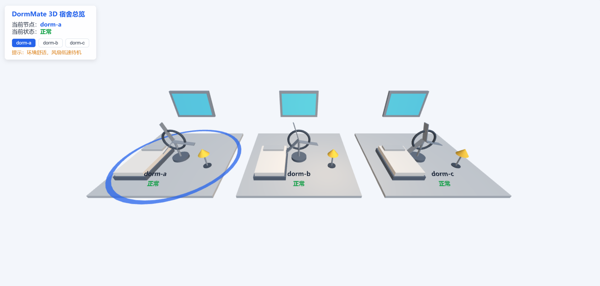
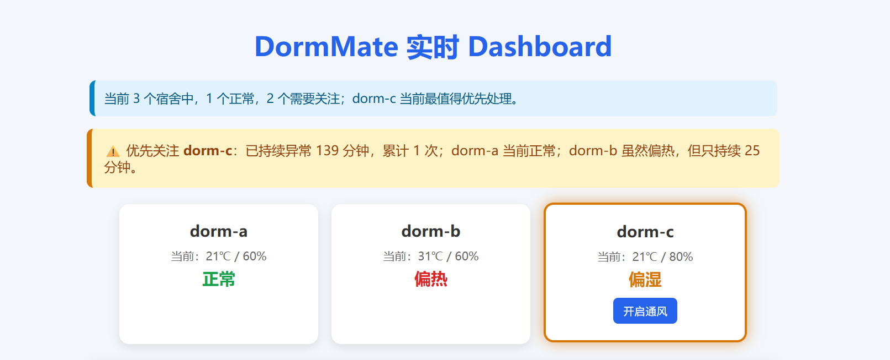
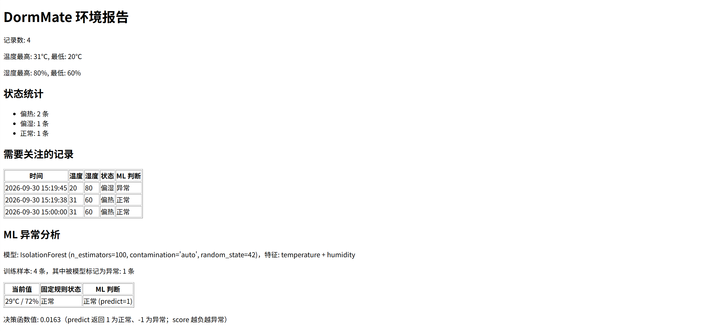
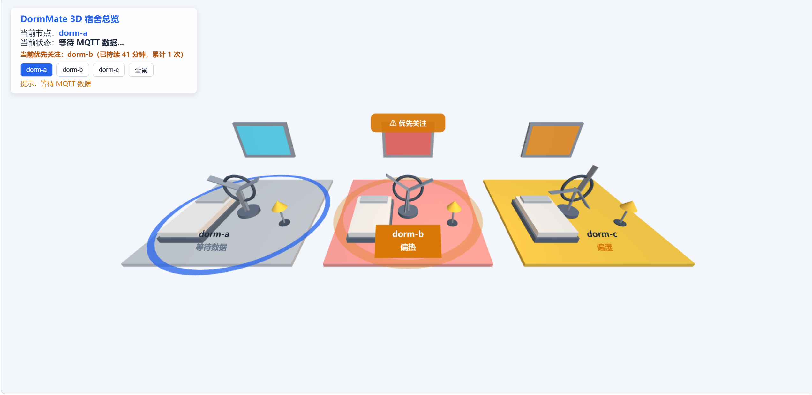

# DormMate 技术文档

低年级综合挑战（C01）综合作品提交材料，覆盖 **D1–D5 基础任务**与 **E1–E3 增强任务**。
文中图片直接引用 `Evidence/` 目录下的现有证据，导出 PDF 时自动嵌入。

---

## 1. 项目与需求

### 1.1 项目目标

DormMate 是一个**多节点宿舍环境助手**：把"感知 → 判断 → 处理 → 验证 → 复盘"链路走通，并让**多个端看到同一份事实**。系统模拟 dorm-a / dorm-b / dorm-c 三个宿舍节点，共 5 个端：

| 端 | 定位 | 载体 |
|---|---|---|
| Web 主应用 | 手动录入、规则判断、拍照留证、语音交互 | `web/` |
| 实时 Dashboard | 三节点总览、优先关注、下发处理动作、事件复盘 | `dashboard/` |
| 3D 数字空间 | 空间化总览、节点聚焦、事件回放 | `3d/` |
| 微信小程序 | 移动端录入与查看，复用同一套规则 | `miniapp/` |
| Python 离线分析 | 历史趋势、规则与 ML 对照 | `analysis/` |

要回答的问题是：**三个宿舍同时出现异常时，一个值班的人怎样才能不慌、不遗漏、事后说得清楚。**

### 1.2 使用场景

- **异常处置（核心）**：dorm-b 连续 3 条偏热 → Dashboard 与 3D 同时变红；系统按异常持续时长判定 **dorm-b 优先关注**并给出理由 → 管理员点「开启风扇」进入**处理中**，动作记入事件链 → 系统**不立即判定解决**，待后续数据验证后才置**已恢复** → 复盘页看到完整链路（开始时间、优先原因、处理动作、恢复时间、结果）。
- **日常巡检 / 事后分析**：录入温湿度即刻得到判定并同步到其它端；导出的 CSV 交给 `analysis.py` 出趋势图与规则/ML 对照结论。
- **演示与讲解**：3D「事件回放」10 秒复演一次"异常 → 处理 → 恢复"，**不依赖 Broker 与网络**，适合评审现场。

### 1.3 核心问题

| # | 问题 | 应对 |
|---|---|---|
| 1 | 数据不串线 | 节点归属**只认主题层级**，不信任 payload 里的 nodeId |
| 2 | 不知道先看谁 | 用**异常持续时长**做排序键，接近时比累计次数 |
| 3 | 处理完了没验证 | 动作只置"处理中"，**是否恢复交给后续数据判定** |
| 4 | 各端各说各话 | 判定规则**逐字统一**；Dashboard/3D 不重复判定 |
| 5 | 现场无法复现 | 3D 事件回放零依赖；离线分析与实时链路互不依赖 |

### 1.4 需求到实现的映射

| 编号 | 任务 | 主要实现载体 |
|---|---|---|
| D1 | 多节点稳定运行 | 各端 `nodeDataStore` 按节点缓存 + 主题取节点 |
| D2 | 持续异常与优先关注 | `dashboard` 的 `updateNodeState` / `updatePriority` |
| D3 | 处理–验证–恢复 | `dashboard` 的 `handleAction` + 恢复判定；`3d` 的同步表现 |
| D4 | 实时链路故障与修复 | 见 5.3（两次主题层级错误） |
| D5 | 固定规则与 ML 辅助判断 | `analysis/analysis.py` + `report/report.html` |
| E1 | 3D 数字空间增强 | `3d/index.html` 的三分区 + 相机聚焦 + 优先高亮 |
| E2 | Camera / ASR / TTS 增强 | `web/script.js` 的拍照、语音指令分发与朗读 |
| E3 | Web–移动端实时同步 | 四端共同遵守的 Topic 与去重约定（见 3.5） |

---

## 2. 系统架构与数据链

### 2.1 整体架构

```
 录入端（Web / 小程序）──发布──▶ MQTT Broker（mosquitto · ws://127.0.0.1:8083）
   主题：dormmate/<节点>/env（环境数据）· dormmate/<节点>/action（处理动作）
        dormmate/priority（优先关注）——订阅端：Dashboard / 3D / Web / 小程序
   导出 CSV ▼
 离线分析链：CSV → pandas 统一规则复判 → matplotlib 趋势图
             → IsolationForest 对照 → report.html
```

两条链**互相独立**：实时链没有分析脚本也能跑，分析链没有 Broker 也能出报告。

### 2.2 技术栈

| 技术 | 用途 |
|---|---|
| mosquitto | MQTT Broker，WebSocket 8083 同时服务浏览器与小程序 |
| mqtt.js 5.3.4（CDN） | Web / Dashboard / 3D 的 MQTT 客户端，无需构建 |
| 手写 MQTT 客户端 | 小程序端：微信环境不便引入 npm 依赖，只实现协议子集 |
| Three.js r128（CDN） | 3D 数字空间，少量灯光即可表达状态色 |
| Chart.js 4.4.0（CDN） | Dashboard 趋势图，纯静态引入 |
| pandas / matplotlib | 离线分析；`Agg` 后端避免无显示环境下报错 |
| scikit-learn | IsolationForest：无监督、无需标注，两维特征即可运行 |
| http.server | 本地静态服务，零依赖，避免 `file://` 下的跨域限制 |

刻意没有引入前端框架、打包工具、数据库、容器——项目规模不需要，加了反而抬高评审门槛。

### 2.3 离线分析链

```
data/dormmate.csv ──▶ analysis/analysis.py ──▶ report/trend.png
                                          └─▶ report/report.html
```

1. **读取**：`encoding='utf-8-sig'`——带 BOM 的 CSV 直接读会多出一个空列名；
2. **复判**：对每条历史记录用统一规则重新判一次，旧规则写入的数据也能校正；
3. **统计与绘图**：各状态数量、筛出非正常记录，温度与湿度曲线叠加，`Agg` 后端直接存文件；
4. **ML 对照**：IsolationForest 训练与预测，两种判断并排写进 HTML，差异说明（不一致条数、具体温湿度、该组合出现次数）全部由当前数据算出。

特征只取 `temperature + humidity` 两维——维度越高，小样本下离群判断越不稳定。

### 2.4 实时系统链

一次数据的旅程（Web 手动录入）：填 31 / 78 → 前端校验（非空、数字、范围 -50~60℃ / 0~100%）→ 统一规则判定为「偏热」→ 发布到 `dormmate/<选中节点>/env`（`retain: true`）→ Broker 分发给所有订阅端 → 各端按主题取节点、写缓存，**只有当前选中节点刷新界面** → Dashboard 用 `time` 算异常时长并广播 `dormmate/priority`，3D 更新颜色与风扇转速 → 导出 CSV 成为离线分析链的输入。

设计要点：

| 设计 | 解决的问题 |
|---|---|
| 通配符订阅 `dormmate/+/env` | 一条订阅覆盖三个节点，新增节点无需改订阅代码 |
| 节点归属以主题为准 | 脏 payload 写不到别的节点名下 |
| `retain: true` | 新打开的端立刻拿到最后一次真实数据，而不是停在兜底值 |
| `source` 端标识 | 忽略"自己发出又被 Broker 回推"的那条，不打断正在输入的人 |
| `time` 字段 | 异常持续时长的计算依据；缺失会导致排序失真 |

---

## 3. 核心数据与系统机制

### 3.1 数据结构

**统一判定规则**（Web / 小程序 / Dashboard / 离线分析四处一致）：

```
温度 < 18℃                        → 偏冷
温度 ≥ 30℃                        → 偏热
湿度 ≥ 75%（温度在 18–30℃ 之间）   → 偏湿
其余                              → 正常
```

⚠️ 先判温度上下限、再判湿度，所以"31℃ / 80%"是**偏热**而不是偏湿；四处顺序必须一致，否则同一组数据在不同端结论不同。

**CSV 字段**（`data/dormmate.csv`）：

| 字段 | 说明 |
|---|---|
| `nodeId` | dorm-a / dorm-b / dorm-c，多宿舍记录混在一张表里靠它区分 |
| `time` | `YYYY-MM-DD HH:mm:ss`；Dashboard 用 `replace(' ', 'T')` 后交给 `Date` 解析 |
| `temperature` / `humidity` | ℃ / % |
| `status` | 判定结果，离线分析会重新复判一次 |

**运行时状态**（各端内存中，各自维护）：

| 端 | 状态结构 | 关键字段 |
|---|---|---|
| Web | `nodeDataStore` / `historyRecords` / `spotRecords` | 每节点最新值、历史记录、现场记录（缩略图 + 节点 + 状态 + 时间） |
| 小程序 | `nodeDataStore` | 同上，只渲染选中节点 |
| Dashboard | `nodeState` / `processingState` / `eventLogs` | 异常起点与计数、处理中状态、事件链 |
| 3D | `zones` 注册表 | 每间的材质、转速、状态、处理状态、优先标志 |

设计上**不落库**：运行状态是"当前屏幕上的事实"，落盘的是用户主动导出的 CSV。代价见 6.3。

### 3.2 Topic 与 JSON 契约

| Topic | 方向 | Payload |
|---|---|---|
| `dormmate/<节点>/env` | Web / 小程序 → 全体 | `{nodeId, temperature, humidity, status, time, source}` |
| `dormmate/<节点>/action` | Dashboard → 3D | `{nodeId, action:"turn_on_fan", actionName}` |
| `dormmate/priority` | Dashboard → 3D | `{nodeId, durationSec, count, ts, source}` |

三段真实报文（依次为环境数据、处理动作、优先关注广播）：

```json
{"nodeId":"dorm-b","temperature":31,"humidity":78,"status":"偏热","time":"2026-09-30 16:00:00","source":"web-3f9a21"}
{"nodeId":"dorm-b","action":"turn_on_fan","actionName":"开启风扇"}
{"nodeId":"dorm-b","durationSec":168,"count":3,"ts":1759228800000,"source":"dashboard"}
```

三条约束：

1. **`dormmate/priority` 必须是两层**：`+` 只匹配一层，不会命中任何端的 `dormmate/+/env` 订阅；写成 `dormmate/priority/env` 就会污染全部端。
2. **`action` 刻意不 retain**：否则每次打开 3D 页都会重放一次"处理中"；代价是后开的页面拿不到当前处理状态（良性降级）。
3. **`priority` 必须带 `ts` 与心跳**：否则 Dashboard 关掉后 Broker 上的 retain 会让高亮"永远亮着"（12 秒心跳，40 秒时效）。

### 3.3 事件状态机

```
      异常数据累积              点击「开启风扇」           后续数据验证
 ┌──────────────┐         ┌──────────────┐        ┌───────────────────┐
 │ 正常/等待数据  │ ──────▶ │    处理中     │ ─────▶ │ 已恢复 / 仍未恢复   │
 └──────────────┘  转入异常  └──────────────┘  连续验证 └───────────────────┘
        ▲                                                      │
        └──────────── 收到「正常」数据，异常起点与计数清零 ◀────────┘
```

| 事件 | 条件 | 动作 |
|---|---|---|
| 收到非正常数据 | 上一状态是「正常」或「等待数据」 | 记录异常起点，计数归零后 +1 |
| 收到非正常数据 | 已在异常中 | 计数 +1，**异常起点不刷新** |
| 收到正常数据 | 不论是否在处理中 | 异常起点清空、计数归零 |
| 点击处理动作 | 节点处于异常且无处理中 | 置「处理中」，生成事件记录，广播指令 |
| 收到数据 | 处理中，累计 ≥ 2 条且当前为正常 | 置「已恢复」，回填恢复时间 |
| 收到恢复数据 | 持续正常 | 事件记录标记「已恢复」 |

**恢复为什么要"两条"**：单条正常可能只是波动，用它判定"问题解决"会掩盖真实故障；**异常起点为什么不能刷新**：每条都刷新，"持续时长"永远是 0，优先关注就退化成"谁最后上报谁优先"。

```
优先关注候选：状态 ∉ {正常, 等待数据} 且异常起点存在的节点
排序：异常持续时长最大者胜；时长相差 < 1 秒时，累计次数多者胜
输出：节点名 + 持续分钟数 + 累计次数 + 与其它节点的对比说明
```

即**持续 10 分钟的老问题优先于刚冒出来的新问题**。

### 3.4 四处规则一致性

| 位置 | 是否自行判定 | 说明 |
|---|---|---|
| Web `judgeStatus` | ✅ | 唯一判定入口，手动分析与 MQTT 数据都走它 |
| 小程序 `judgeStatus` | ✅ | 阈值、运算符、顺序与 Web 逐字相同 |
| Dashboard | ❌ | 只采信报文的 `status`，做异常时长/次数统计 |
| 3D 场景 | ❌ | 只采信报文，做状态到颜色/转速的映射 |
| 离线分析 | ✅ | `judge_status(row)`，复判历史 CSV |

**为什么展示端不判定**：每端都判一次，阈值迟早漂移，会出现"同一组数据在不同端显示不同状态"的矛盾。判定只发生在**数据入口**（Web/小程序）与**离线复判**两处。

### 3.5 同步机制与边界情况

四个端直接订阅同一个 Broker，同步靠三条约定：**同一 Topic 结构、同一判定规则、同一去重语义**。

| 边界情况 | 处理方式 |
|---|---|
| 自己发布的消息被 Broker 回推 | payload 带 `source`（如 `web-3f9a21`），本端忽略回声 |
| 重连后 Broker 重放 retained 报文 | 3D 对处理中的计数按 `time` 去重 |
| 动作与数据来自不同客户端（乱序） | Broker 只保证同连接内有序；3D 可能比 Dashboard 晚一条消息判定恢复，属可接受偏差 |
| 判定消息过期 | `ts` + 时效窗口（40 秒 ≈ 3 倍心跳），过期即清除高亮 |
| 节点从未上报数据 | 显示"等待数据"，不参与优先关注排序（区别于"正常"） |

小程序端 MQTT 客户端为**手写实现**（`miniapp/utils/mqtt-client.js`，约 320 行）：CONNECT 握手、SUBSCRIBE(QoS 0)、PINGREQ 保活、PUBLISH 解帧、`+` 单层通配符、3 秒断线重连——微信环境对第三方包不友好，而项目只需协议的一个小子集。

---

## 4. D1–D5 与 E1–E3 的关键实现

### D1 多节点稳定运行

节点归属**只认主题层级**（`dormmate/dorm-b/env` 的第 2 段）；payload 里的 `nodeId` 只作展示、不参与路由，脏数据只会写进主题所指的节点，**只有当前选中节点才刷新界面**。验证：MQTTX 分别给三节点发不同数据，三端各显示各的。



视频：`Evidence/D1_多节点/D1_同时驱动更新.mp4`

### D2 持续异常与优先关注

优先级要反映**紧迫程度**：以**异常持续时长**为主排序键，时长接近（< 1 秒）时比累计次数——前者是"被忽略多久"，后者是"异常有多密"。每条数据更新异常起点与计数 → 遍历三节点取时长最大者 → 生成一句可直接读出的对比说明：

> ⚠️ 优先关注 dorm-b：已持续异常 5 分钟，累计 7 次；dorm-a 当前正常；dorm-c 虽然偏湿，但只持续不到 1 分钟

判定经 `dormmate/priority` 广播给 3D 渲染光圈与标签——**不在 3D 里重写排序逻辑**。



另外两组对比：`D2_多组数据对比2.png`、`D2_多组数据对比3.png`

### D3 处理–验证–恢复

动作只置「处理中」并留痕，**恢复与否完全由后续数据判定**：**累计 ≥ 2 条且当前为正常**才判「已恢复」（不要求连续两条都正常），回填恢复时间与结果；"点了按钮但问题依旧"会如实记为「仍未恢复」。同一节点可开启第二轮处理；事件记录含开始时间、问题描述、优先原因、处理动作、恢复时间、最终结果，形成可追溯的处置链。

视频：`Evidence/D3_处理修复/D3_完整修复过程演示.mp4`

### D4 实时链路故障与修复

MQTTX 发消息后 Dashboard 不更新；控制台无报错 → 消息根本没进回调 → 订阅主题写成 `dormmate/dorm-c/wrong`，实际发布的是 `dormmate/dorm-c/env`——MQTT 主题是**精确匹配**，差一个字符就完全收不到；订正后恢复。同类问题：3D 页订阅写成 `dormmate/dorm-a`（漏掉 `/env` 层级），表现为"永远等待数据"，改为 `dormmate/+/env` 通配符订阅，顺带解决新增节点要改订阅的问题。**经验：MQTT 的"没反应"绝大多数是主题不匹配，第一步永远是对订阅与发布主题逐字符核对。**

视频：`Evidence/D4_故障修复/D4_写错Topic现象及修复后重新运行.mp4`

### D5 固定规则与 ML 辅助判断

固定阈值回答不了"这条数据在历史上是否罕见"，纯 ML 又会丢掉可解释性与确定性——**两者并排，各司其职**：规则管红线（绝对阈值），ML 管离群（相对罕见度）。特征只用 `temperature + humidity` 两维；`IsolationForest(n_estimators=100, contamination='auto', random_state=42)` 以历史 CSV 为训练集；并**主动标注样本量不足**的警告。典型分歧：某组合被规则判为偏热，但在训练集中已多次出现，模型判为正常——**规则回答"该不该处理"，ML 回答"该不该怀疑"**。



另外两张：`D5_report_ML分析板块2.png`、`D5_终端_ML与规则对照结果.png`

### E1 3D 数字空间增强

把"三个宿舍"从列表变成空间认知：

1. **三个区域各自绑定 nodeId**，各持有独立材质与风扇转速，三间**同时**呈现不同状态；
2. **相机用「距离 + 注视点」两个量描述**，补间只插这两个量，全程**纯推轨、不转头**（位置恒等于"方向向量 × 距离 + 注视点"），正对视角才能看清扇叶的旋转面；
3. **优先关注用不受光的材质高亮**（呼吸光圈 + 浮动标签），**不新增光源**——光照总量已接近 1.0，再加灯会把材质颜色裁成纯白（见 5.3 故障 2）；
4. 每间上方一个**浮动标签**，按"处理中 > 已恢复 > 优先关注"只显示一条。

点击按钮或区域 → 选中环移动 + 镜头平滑推进；处理中时该间风扇保持提速，直到验证恢复。



另外两张：`E1_节点聚焦_选中DormB.png`、`E1_3D处理中状态.png`

### E2 Camera / ASR / TTS 增强

ASR 对中英混说的转写极不稳定，按书面写法写匹配规则会大面积失效；识别后先归一化（NFKC 统一全角、去空格标点、转小写），再做否定句拦截（"不要记录现场"不执行）。

| 指令 | 行为 |
|---|---|
| 查看 dorm-b | 面板切到 dorm-b 并显示实时数据，回应"已切换到宿舍B" |
| 朗读状态 | 念出节点 + 温度 + 湿度 + 状态，如"宿舍B，温度 31 度，湿度 78%，状态 偏热" |
| 记录现场 | 调起摄像头拍照，照片与**当前节点、当时状态、时间**一起存入现场记录 |

**关键实现**：节点识别分三档——`dorm-*` → `宿舍B` → "查看类动词 + 附近一个独立 a/b/c 字母"（兜底档，中文识别常把 `dorm b` 转写成"多姆B""dorm bee"等变体）；**拍照与语音共用同一条函数**；列表只存 **160×90 缩略图**（约 10 KB）而非原图（0.5–2 MB）；中文 TTS 会把 `dorm-b` 逐字母念出，所以朗读用「宿舍B」，记录里仍显示 `dorm-b`。

视频：`Evidence/E2_多模态交互/E2_多模态交互演示.mp4`

### E3 Web–移动端实时同步

不引入中间层，让四个端对同一份数据得出一致结论——同步不靠"同步代码"，靠**约定**：同一 Topic 结构、同一判定规则、同一去重语义（见 3.5）。处理动作经 `dormmate/<节点>/action` 跨端联动（Dashboard 点击 → 3D 风扇提速 + 处理中标签）。

视频：`Evidence/E3_跨端同步/E3_MQTT开启风扇.mp4`

---

## 5. 测试、故障与验证

### 5.1 测试方法

**手工复现**（评委可直接照做）：见 5.5 与 `Evidence/README.md` 的启动顺序与逐项步骤。

**自动化桩测试**（开发期使用）：三个核心页面各有一套 Node 桩测试，用最小 DOM / Three.js / MQTT 桩把**真实脚本**跑起来，断言关键行为，无需浏览器与 Broker：

| 套件 | 断言数 | 覆盖重点 |
|---|---|---|
| 3D 场景 | 112 | 三分区与坐标、状态只影响对应节点、点击拾取、优先高亮与过期、处理中/恢复判定、相机推轨不变量、事件回放时间轴 |
| Web 语音与拍照 | 52 | 指令解析（全角/大小写/夹字/否定句/转写变体）、切换节点、拍照内容、朗读文案、无关语句不误触发 |
| Dashboard 动作 | 21 | MQTT 手发指令与点击同等记录、防回环、action 报文不污染节点状态 |

合计 **185 项断言**，作为**回归护栏**——例如"包围盒必须跟着注视点平移"这条断言直接抓出了相机聚焦距离算错的问题。

### 5.2 D1–D5 验证方式

| 项 | 操作 | 预期结果 |
|---|---|---|
| D1 | 三端同时打开，MQTTX 分别给三个节点发不同数据 | 三端各显示各的，互不串线 |
| D2 | 连发 3 条 dorm-b 偏热 | 横幅提示"优先关注 dorm-b"，并给出与其它节点的对比 |
| D3 | 点击"开启风扇" → 发 1 条正常 → 再发 1 条正常 | 第 1 条仍是"处理中"，第 2 条变"已恢复" |
| D4 | 故意把 Topic 写错 | 页面不更新；改回正确 Topic 后恢复 |
| D5 | `cd analysis && python analysis.py` | 终端打印规则/ML 对照；`report/report.html` 出现 ML 分析与差异说明 |

### 5.3 真实故障与修复

除 D4 记录的主题故障外，开发过程中还定位并修复了三处真实缺陷：

| # | 现象 | 根因 | 修复 |
|---|---|---|---|
| 1 | 3D 页永远停在"等待数据" | 订阅漏写层级：`dormmate/dorm-a` ≠ `dormmate/dorm-a/env` | 改为 `dormmate/+/env` 通配符订阅 |
| 2 | 3D 地板与窗户变成**纯白**，看不出状态色 | 三盏灯强度之和约 2.0（three.js 中 1.0 即满亮度），材质颜色各通道被裁到 1；叠加玻璃写死的蓝色自发光 | 三盏灯改为 0.5 / 0.5 / 0.2；窗户自发光跟随状态色 |
| 3 | 说"查看 dorm b"无反应 | Chrome 中文识别把中英混说转写成"多姆B""dormbee"等变体，正则要求字面 `dorm` 导致漏配 | 改为三档匹配 + 否定句拦截（见 E2） |
| 4 | 3D 点同一宿舍第二次无法重新聚焦 | "重复点击早退"的保护把聚焦一起挡掉了 | 早退分支中同样触发聚焦 |

故障 2 是"看起来像渲染 bug、实际是数值问题"——先算各光源对材质各通道的贡献，发现红通道合计 ≈ 1.03 已顶到上限，再验证"颜色被裁到 1"的假设，**颜色异常先算光照总量，比调材质更有效**；故障 3 说明**语音匹配要按 ASR 的实际转写特点设计**，且"识别失败"与"识别成功但没匹配上"要在界面上区分开。

### 5.4 Rule / ML 对照

| 维度 | 固定规则 | IsolationForest |
|---|---|---|
| 判断依据 | 绝对阈值（18℃ / 30℃ / 75%） | 该数据在历史样本中的相对罕见程度 |
| 是否依赖历史 | 否 | 是 |
| 输出 | 偏冷 / 偏热 / 偏湿 / 正常 | 正常 / 异常（+ `decision_function` 分值） |
| 回答的问题 | **该不该处理** | **该不该怀疑** |
| 可解释性 | 完全可解释 | 需借助"该组合出现过几次"来解释 |

对照要在**同一套语义**上比较——"是否越线"对应"是否离群"，不能拿规则的四分类直接比 ML 的二分类字符串，否则"偏湿"与"异常"会被误判成一次分歧。两者结论**可以不同而且都正确**；报告会自动写出差异条数、具体温湿度组合及出现次数，并标注样本量是否足以支撑 ML 结论。

### 5.5 README 交叉复现

- 根目录 `README.md`：统一规则、模块一览（M1–M6 与运行方式）、实时链路主题、排错记录——面向"这个项目怎么跑"。
- `Evidence/README.md`：环境要求、启动顺序、MQTT 配置、多端同步验证步骤、D1–E3 逐项快速复现——面向"评委如何现场复现"。

三份文档在统一规则、Topic 命名、启动端口（8083）、D1–E3 判定标准上均无冲突。

---

## 6. 自主设计与开放拓展

### 6.1 新增技术清单

| 新增技术 | 动机与作用 | 验证证据 | 已知限制 |
|---|---|---|---|
| **MQTT 判定广播**（`dormmate/priority`） | 3D 不必重写排序逻辑，直接消费 Dashboard 的判定渲染光圈与标签 | E1 截图中的呼吸光圈与横幅 | 依赖 Dashboard 打开；关闭后高亮最多 40 秒自动清除 |
| **判定的时效与去重** | 纯粹 retain 会留下永久高亮；`ts` + 时效窗口判定失效，`source` 隔离回声 | 关闭 Dashboard 后高亮按时消失 | 时效窗口是经验值，时钟不一致时会有偏差 |
| **每节点独立场景状态** | 只按选中节点上色看不出多节点；三间同时呈现各自状态 | E1 多节点全景截图 | 三间共享同一组灯光（见 5.3 故障 2） |
| **处理中状态由 3D 自行推断** | 不为处理状态再开 MQTT 通道；3D 只凭 action 报文 + 后续数据判断，与 Dashboard 规则逐字对齐 | `E1_3D处理中状态.png` | 3D 页若在动作**之后**才打开，不显示"处理中"（良性降级） |
| **手写 MQTT over WebSocket 客户端** | 微信环境不便引入 npm 依赖；小程序零第三方依赖独立收发 | 小程序与 Web 同时更新 | 只实现用到的报文类型与单层 `+` 通配符 |
| **语音指令归一化匹配** | ASR 转写不稳定；容忍全角、大小写、夹字、标点与转写变体 | E2 演示视频 | 兜底档会把"打开 dorm-book"判成切到 dorm-b |
| **现场记录缩略图** | 原图存列表会让页面越用越卡；列表只存 160×90 缩略图 | E2 演示视频 | 只存在内存中，刷新即丢失 |

### 6.2 开放拓展：3D 事件回放

**选型过程**：三个候选方向逐一评估后选择回放。

| 方向 | 成本 | 主要障碍 |
|---|---|---|
| 统一状态接口 | 中 | Mosquitto 只开了 8083 的 WebSocket、没有 1883；Python 侧要拿实时数据必须新增 MQTT 依赖，且状态中心会成为第五份状态副本 |
| 自动日报 | 低 | 处理动作与恢复记录只存在于 Dashboard 内存中，无法从 CSV 完整还原 |
| **3D 事件回放** | 低 | **零依赖、不依赖 Broker 与网络，断网也能完整演示** |

**实现方式**：`3d/replay.json` 中每一步都是一条与 MQTT 报文**同构**的 `{topic, payload}`：

```json
{ "at": 5.0, "topic": "dormmate/dorm-b/action",
  "payload": { "nodeId": "dorm-b", "action": "turn_on_fan", "actionName": "开启风扇" } }
```

回放时把每一步喂给**与实时消息完全相同的那条处理链路**（`applyMqttMessage`）：回放不是"另写一套演示动画"，而是在**复演真实报文走过的逻辑**，跑通回放本身就在验证这条链路；且只作用于 3D 页面本地，不向 MQTT 发布任何内容，回放期间忽略实时消息以免打乱剧情。

**演示内容**：13 步 / 约 10 秒，覆盖 dorm-b 偏热三连 → 判定优先关注 → 开启风扇（处理中）→ 另一节点同时出现异常（体现多节点并行）→ 两条正常数据后判定恢复 → 优先关注转移到 dorm-a → 全部恢复。

**验证证据**：待补（建议录制"点击事件回放后的完整 10 秒过程"）。

### 6.3 已知限制与改进方向

| 限制 | 影响 | 若继续推进的下一步 |
|---|---|---|
| Broker 在本机，无公网部署与鉴权 | 跨网络无法使用，仅适合单机演示 | 加 TLS 与账号密码；放到内网服务器 |
| 运行状态不落库 | 刷新页面即丢失处理记录与现场记录 | 引入轻量存储（SQLite / 本地文件），或把事件链发布到 MQTT 由服务端落盘 |
| ML 样本量小 | IsolationForest 结论不具统计意义 | 积累数据到数百条以上再复训；报告已自动标注样本不足警告 |
| 小程序为测试号，未真机验证 | 需勾选"不校验合法域名"才能连本机 Broker | 申请正式号 + 部署 HTTPS/WSS |
| 3D 页在动作之后打开看不到"处理中" | 观感上少一个状态 | 在 `dormmate/priority` 广播中附带处理状态字段 |
| 动作报文不 retain | 后开的端拿不到当前处理状态 | 同上；或改为带时间戳的 retain 并配合时效判定 |
| 语音兜底匹配可能误判 | "打开 dorm-book"会被判为切到 dorm-b | 收紧为"动词 + 限定长度 + 独立字母"，或引入指令白名单 |
